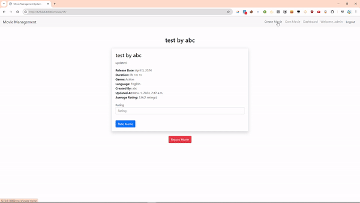

# Welcome to Movie Management System 👋


## Features

- **User Management:**
  - User can signup, 
  - User can login with email or username
  - User logout

- **Movie Management**
  - Any user can view list of movies.
  - To view the details of movie user has to login.
  - After login user can create movie.
  - View their own movies. 
  - Update it's own movie.
  - Delete it's own movie.
  - User can report other's movie.
  - Easy to view the movie list because of the pagination

- **Admin**
    - Admin can view how many movies were created.
    - Admin can view how many users signed up.
    - Admin can see total number of reports.
    - Admin can manage the reports according to the report reason.
  

## Run Locally

Clone the project

```bash
  git clone https://github.com/sin1ter/Movie-Management-System.git
```

Go to the project directory

```bash
  cd movie_management_system
```

# For Windows
```bash 
   python -m venv env

   env\Scripts\activate
```

 # For macOS/Linux
 ```bash
   python3 -m venv env
   
   source env/bin/activate
   ```

Install dependencies

```bash
  pip install -r requirements.txt
```

Start the server

```bash
  python manage.py runserver
```
    
## Author

👤 **Symon**

- Github: [@sin1ter](https://github.com/sin1ter)
## Demo


# Demo Gifs:





# Full project demo:
```
https://drive.google.com/file/d/1XGvveugWSFzszcXG4jhTOmFTHAMfdvcA/view?usp=sharing
```